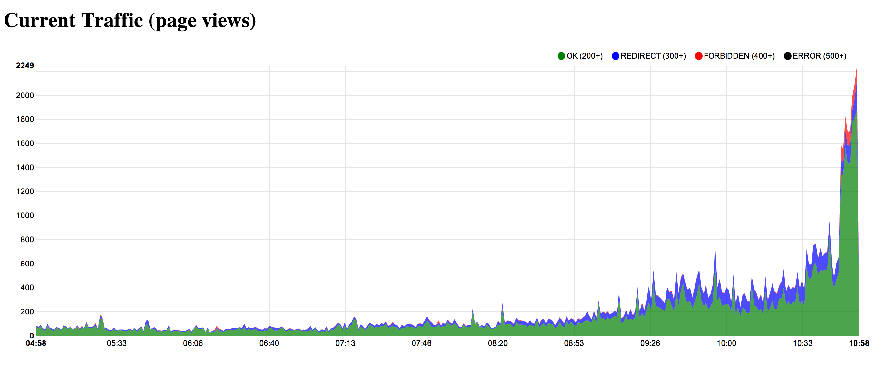

# HTTP statuser

Er ment å vise realtime data over sidevisninger, både vellykkede sidevisninger, og de som går galt (http status 400 og 500).

Siden vi ikke har realtime data starter vi på en dato i 2012 og viser data for ett og et minutt hvert sekund.